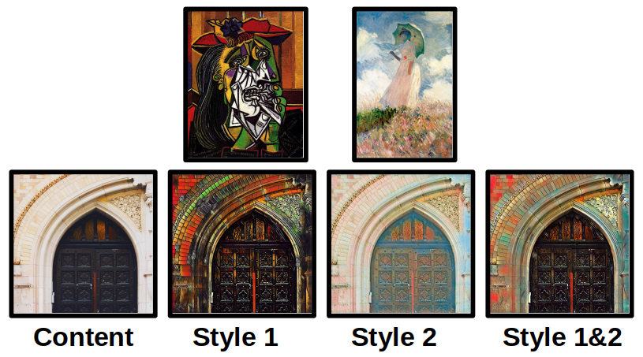
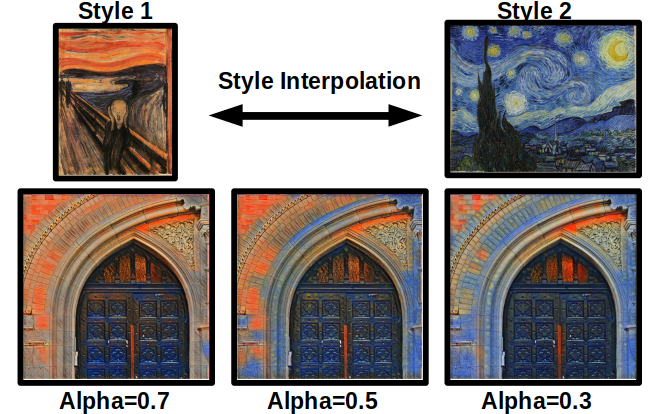

# Multiple Style Transfer

This is an original python implementation of real-time style transfer [[1]](#1).  Style transfer is rendering one image (content image) with the style of another image (style image).

Style transfer was originally achieved iteratively, and therefore substantial rendering time, to "optimize" the output images [[2]](#2).  This allows for videos to be rendered within a reasonable timeframe. (Left: Original, Right: Rendered with candy.model)

The real-time style transfer from [[1]](#1) trains a feed-forward neural network to perform the style transfer in one forward pass.  My implementation of this framework was additionally designed to allow for the combination of two or more styles during training [(Project Paper)](https://arxiv.org/abs/1911.06464).  I was able to achieve this using two methods; one where I combine the style losses of each style image using the original framework from [[1]](#1), and another using knowledge distillation from pretrained style feed-forward neural networks [[3]](#3).  

The first method also allowed for interpolation between the contribution of each style image in the final result.

# Running Code:

Conda Environment: environment.yml
* python 3.9.4
* pytorch 1.8.1
* opencv 4.5.1

Training:
* train.py for loss method
* distillation.py for distillation method

Both have example commands for calling these scripts in the bash file, run_training.sh. The dataset that I used for training was the 2017 common objects in context (COCO) data set. It can be found at [COCO] (https://cocodataset.org/#download).  The datapath input to train.py and distillation.py should point to the parent COCO folder on your machine where the training, val, and test image set folders are located.  Using this dataset took me about 3:00 - 3:30 hrs to train using a gtx 1080.

Rendering:
* render_image.py for images
* render_video.py for videos

Both have example commands for calling their respective scripts (render_image.sh, render_video.sh)

# Interested and want to learn more

If you are interested in learning about more current advances in style transfer check out these following papers (not my work):

One drawback of the feed-forward network in this framework is that it is tied specifically to the style image it is trained on.  For each new style image, an entirely new network must be trained.  These two papers aim to tailor the feed-forward network so that it can be trained to perform on any arbitrary style image without being retrained.

Arbitrary Style Transfer in Real-time with Adaptive Instance Normalization
https://arxiv.org/pdf/1703.06868.pdf

Exploring the structure of a real-time, arbitrary neural
artistic stylization network
https://arxiv.org/pdf/1705.06830.pdf

## References

<a id="1">[1]</a> 
Justin Johnson, Alexandre Alahi, and Li Fei-Fei (2016). 
Perceptual Losses for Real-Time Style Transfer
and Super-Resolution

<a id="2">[2]</a> 
Leon A. Gatys, Alexander S. Ecker, Matthias Bethge (2015)
A Neural Algorithm of Artistic Style

<a id="3">[3]</a> 
Geoffrey Hinton and Oriol Vinyals and Jeff Dean (2015)
Distilling the Knowledge in a Neural Network
